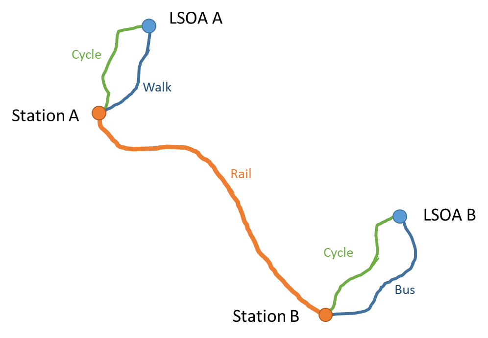
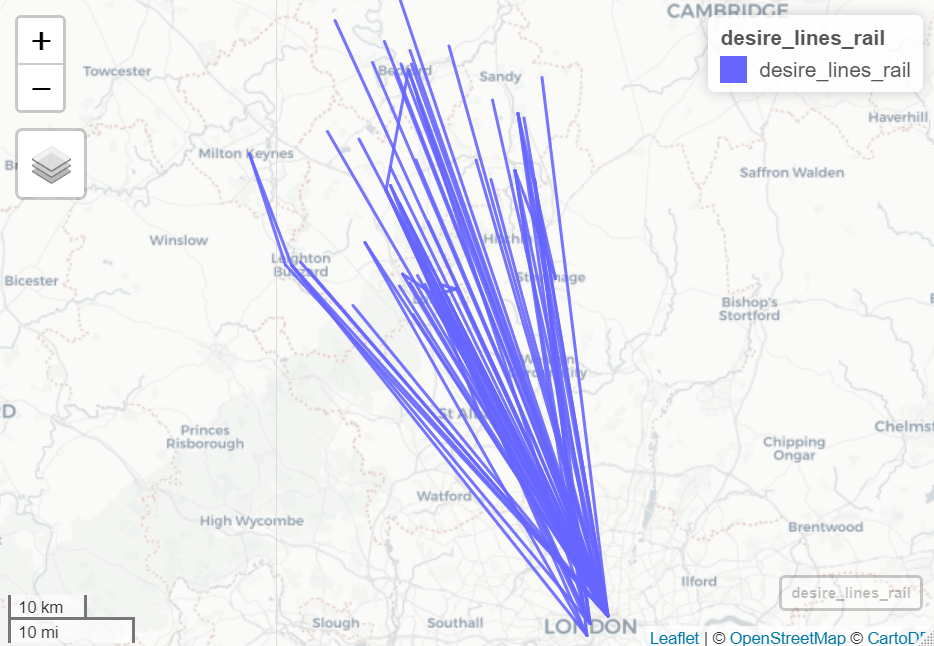
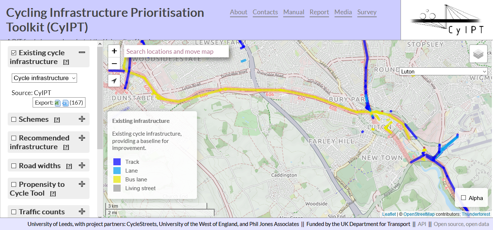

```{r setup, include=FALSE}
knitr::opts_chunk$set(
  echo = FALSE,   
  collapse = TRUE,
  comment = "#>"
  )
```

# Introduction

Combining rail travel with cycling is one of the most flexible ways to get around, opening up destinations that might not otherwise be reachable without using a private motor vehicle. Rail stations represent a major destination for cycle journeys, and travel by rail has almost doubled in the last 20 years (ORR 2019). As such, it is vital to understand the dynamics of cycle-rail integration. We investigate this for commuter journeys originating in Bedfordshire.

The Propensity to Cycle Tool (Lovelace et al. 2017) uses 2011 Census data to investigate the proportion of commuters that currently cycle to work, alongside a range of scenarios investigating how cycling levels could increase. These scenarios include two different approaches to meeting the Government target of doubling cycle commutes. Additionally, the 'Gender Equality' scenario models what would happen if women cycled as much as men currently do, since this is the norm in high-cycling countries. The 'Go Dutch' scenario models what would happen if cycling in the UK was at the same levels as found in the Netherlands, while accounting for the impact of hilliness and journey distance.  The 'Ebikes' scenario expands this by assuming widespread adoption of ebikes for longer distance commutes. 

However, the treatment of commuter journeys in all of these scenarios suffers from a vital limitation. The 2011 Census provides a comprehensive dataset of journey origins and destinations, but the Census questions relating to commuter travel only record the main mode of transport to work, defined as the mode used for the longest portion of the journey according to distance. Therefore, multimodal journeys are not represented. This is particularly problematic when it comes to journeys involving public transport. 

In reality, almost all journeys involving public transport will necessarily be multimodal journeys (Figure 1). The passenger must first reach the train station, bus or tram stop, perhaps doing so on foot, on cycle, or by car or taxi. Following a journey on one or more forms of public transport, they will again require a further trip stage to reach their final destination. 

```{r combi1, fig.cap="An example showing the multimodal nature of most rail journeys"}

```

In counties such as Bedfordshire, commuting by rail is widespread, with the great majority of these commuters travelling to work in London (Figure 2). There are therefore a large number of people travelling to and from local rail stations, who could potentially by accessing these stations by bicycle. These cycle journeys are currently being missed from our estimates of cycle propensity.

```{r combi2, out.width="100%", fig.cap = "Desire lines for MSOA commute data showing all journeys starting in Bedfordshire where at least 20 people travel by rail"}

```

Including journeys to rail stations in the assessment of cycle potential gives a more complete picture of where people want to cycle. This will aid cycle infrastructure planning and the choice of where to focus investment. 


## Aims

The aims of this project are to:

- Establish the potential for cycling to stations in the STARS study area

- Inform investment decisions regarding cycle infrastructure and cycle parking at stations

- Feed into monitoring and evaluation of cycling levels


## Modal split of commuting

A high proportion of Bedfordshire commuters currently drive to work. Yet we can see that there is significant potential for cycle commuting to increase. Table 1 shows that the percentage who cycle to work in Bedfordshire currently stands at between 1-4%. If residents were to reach Dutch levels of cycling, this would jump to 14-25%. However, this still ignores the possibility of combined cycle and rail commuting. If we also consider the cycle-to-rail potential, the proportion of cyclists could rise even higher. 

```{r combi3, message = FALSE}
library(dplyr)
readr::read_csv("./output-data/mode-data-local-authority.csv") %>% 
  knitr::kable()
```

When we look at individual station catchments, the picture is similar. Again, even when we ignore the potential for combining rail and cycle, the cycle mode share in each catchment could rise substantially, from a 10% rise at Flitwick to a 21% rise at Bedford Midland.

```{r combi4, message = FALSE}
readr::read_csv("./output-data/mode-data-nearest-catchments.csv") %>% 
  knitr::kable()
```

## Intra-region travel

Around half of all commutes in Bedfordshire take place entirely within the county. When looking at these journeys, we can see that the majority of them are to the nearest town centre, although there is also some inter-town travel. A high proportion of the shorter journeys are made by active travel. These journeys could be similar in distance to many journeys to rail stations, which may also be likely to be made by active travel. 

```{r combi5, out.width="50%", fig.cap="The proportion of commuter journeys within Bedfordshire that are made using active travel"}
knitr::include_graphics("./figures/bedford-intra-region-commutes.png")
```

# Methodology

We have developed two methods for estimating cycle to rail stations. 

Our Phase 1 approach starts with Census OD data. Transport API is used to find out whether the trip could be made by rail to arrive by 9:00 AM. The fastest rail journey is then used. This method does not simply route commuters to their nearest station, but takes account of their final destination to pick an appropriate station. 

The Phase 2 approach starts with commutes that are already made by rail. These are routed via the nearest station as the crow flies. This is different from the Phase 1 approach in which the departure station was chosen based on the rail journey time only. Based on these routings, we estimate the potential for the journey from home to station to be cycled. 

In Phase 2 we only use mainline Bedfordshire stations. These all have frequent direct services to London, and are well-used with seven of the ten stations having over 1 million entries and exits in 2016-17. This gives us the seven most-used rail stations in Bedfordshire, as listed in Table 3 below. These comprise six stations on the Midland Mainline, three stations on the East Coast Mainline, and one stations on the West Coast Mainline. Since all of these stations have frequent services to and from London, routing via the nearest station is realistic. 

### All rail commutes (Phase 1 and 2 estimates)

The first step is to identify trips that could be made by cycle and rail. @ref/combi6 shows all rail commutes originating in Bedfordshire, as estimated according to our Phase 1 and Phase 2 approaches. The two panels differ because under the Phase 1 method trips are routed to a station that provides the shortest rail journey time, which can include stations outside Bedfordshire, while in Phase 2 trips are routed to the nearest station, including only the seven largest Bedfordshire stations.  

```{r combi6, out.width="50%", fig.show='hold', fig.cap = "Phase 1 and 2 estimates of cycle to rail potential"}
knitr::include_graphics(c("./figures/bedford-rnet-all-phase1.png","./figures/bedford-rnet-all-phase2.png"))
```

### Go Dutch cycle to rail stations (Phase 1 and 2 estimates)


```{r combi7, out.width="50%", fig.cap="Cycle commuting to rail stations under the Phase 1 and Phase 2 approaches"}
knitr::include_graphics(c("./figures/bedford-rnet-go-dutch-phase1.png","./figures/bedford-rnet-go-dutch-phase2.png"))
```

We can see some notable differences between the modelled distributions of cycling to stations under Phase 1 and Phase 2. In particular, Phase 2 shows many more cycle trips to Leagrave station. Most of these were routed to Luton station in the Phase 1 method, but since Leagrave has a good quality rail service to London, with trains running every 15 minutes, it seems reasonable to assume that commuters who cycle to the station would be more likely to use Leagrave if it is their nearest station.


# Cycle infrastructure

This analysis can help to identify places where it would be particularly useful to install new or improved cycle infrastructure, or to increase cycle parking.

In Luton, we can see that the existing cycle infrastructure is relatively limited.

```{r combi8, out.width="100%", fig.cap="Existing cycle infrastructure in central Luton, as recorded by CyIPT"}

```

There is a strong overlap between the roads we find high to have cycle potential and proposed new cycle routes in Luton. These includes routes heading west from Leagrave station along Leagrave High Street, a route north from Leagrave station, and north from Luton station along High Town Road.

# References

ORR (2019), '2019-20 Q1 Statistical Release – Passenger Rail Usage | ORR Data Portal’. Accessed 12 November 2019. https://dataportal.orr.gov.uk/statistics/usage/passenger-rail-usage/.

