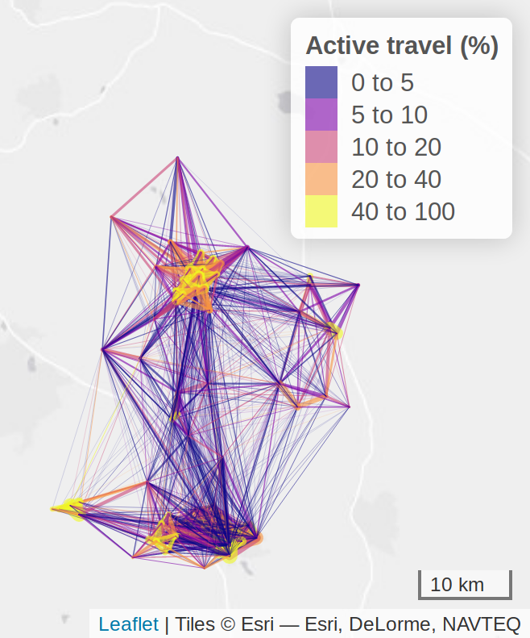

```{r setup, include=FALSE}
knitr::opts_chunk$set(
  echo = FALSE,   
  # eval = FALSE,
  collapse = TRUE,
  comment = "#>"
  )
```

# Introduction

In 2018, transport was responsible for more CO~2~ emissions than any other UK sector (BEIS 2019). To reduce carbon emissions and air pollution we need to move away from private vehicle use and increase uptake of sustainable travel modes such as walking, cycling and public transport. Increasing cycling uptake will have major health benefits, not only due to its impact on air pollution but also because maintaining sufficient levels of physical activity can help to prevent or manage a wide range of physical and mental health conditions (BMA 2019). 

Combining rail travel with cycling is one of the most flexible ways to get around, opening up destinations that might not otherwise be reachable without using a private motor vehicle. Rail stations represent a major destination for cycle journeys, and travel by rail has almost doubled in the last 20 years (ORR 2019). As such, it is vital to promote cycling to rail stations and to do this we need to understand the dynamics of cycle-rail integration. We investigate this for commuter journeys originating in Bedfordshire.

## The local context

Rail commuting is especially important in Bedfordshire due to its location in the London commuter belt. Across the county 5-7% of people travel to work by rail, with London being the most important destination. Almost 90% of Bedfordshire residents who commute by rail live within 5 km of a mainline rail station, suggesting that if the right conditions were in place many of these people could reach the station by bicycle.

In Luton, the compact urban form of the town centre means there is a particular need to reduce emissions. In a recent study investigating air pollution in the 146 largest British settlements (MacKenzie et al. 2019), Luton had a middling rank in terms of NO~x~ emissions per capita, but came at the very bottom of the table in terms of the difference in rankings between the amount of emissions produced and their airborne concentrations. This provides a strong evidence base for measures to promote active travel in Luton, becuase it means any reduction in emissions here will have an unusually large impact in terms of reducing air pollution.

## Modelling cycle journeys

The Propensity to Cycle Tool (Lovelace et al. 2017) uses 2011 Census data to investigate the proportion of commuters that currently cycle to work, alongside a range of scenarios investigating how cycling levels could increase. These scenarios include two different approaches to meeting the Government target of doubling cycle commutes. Additionally, the 'Gender Equality' scenario models what would happen if women cycled as much as men currently do, since this is the norm in high-cycling countries. The 'Go Dutch' scenario models what would happen if cycling in the UK was at the same levels as found in the Netherlands, while accounting for the impact of hilliness and journey distance. Finally, the 'Ebikes' scenario expands this by assuming widespread adoption of ebikes for longer distance commutes. 

However, the treatment of commuter journeys in all of these scenarios suffers from a vital limitation. The 2011 Census (ONS 2020) provides a comprehensive dataset of journey origins and destinations, but the Census questions relating to commuter travel only record the main mode of transport to work, defined as the mode used for the longest portion of the journey according to distance. Therefore, multimodal journeys are not represented. This is particularly relevant when it comes to journeys involving public transport. 

In reality, almost all journeys involving public transport will necessarily be multimodal journeys (Figure 1). The passenger must first reach the train station, bus or tram stop, perhaps doing so on foot, on cycle, or by car or taxi. Following a journey on one or more forms of public transport, they will again require a further trip stage to reach their final destination. 

```{r combi1, fig.cap="An example showing the multimodal nature of most rail journeys", out.width="50%", fig.align='center'}
knitr::include_graphics("./figures/multi-stage-rail-schematic.png")
```

In counties such as Bedfordshire, commuting by rail is widespread, with the great majority of these commuters travelling to work in London (Figure 2). There are therefore a large number of people travelling to and from local rail stations, who could potentially by accessing these stations by bicycle. These cycle journeys are currently being missed from our estimates of cycle propensity.

```{r combi2, out.width="80%", fig.cap = "Desire lines for MSOA commute data showing all journeys starting in Bedfordshire where at least 20 people travel by rail", fig.align='center'}
knitr::include_graphics("./figures/rail_desire_lines.png")
```

Including journeys to rail stations in the assessment of cycle potential gives a more complete picture of where people want to cycle. This will aid cycle infrastructure planning and the choice of where to focus investment. 


## Aims

The aims of this project are to:

- Establish the potential for cycling to stations in the STARS study area

- Inform investment decisions regarding cycle infrastructure and cycle parking at stations

- Feed into monitoring and evaluation of cycling levels


## Modal split of commuting

A high proportion of Bedfordshire commuters currently drive to work. Yet we can see that there is significant potential for cycle commuting to increase. Table 1 shows that the percentage who cycle to work in Bedfordshire currently stands at between 1-4%. If residents were to reach Dutch levels of cycling, this would jump to 14-25%. However, this still only counts journeys that are made entirely by bicycle, and ignores the possibility of combined cycle and rail commuting. If we also consider the cycle-to-rail potential, the proportion of cyclists could rise even higher. 

```{r table1, message = FALSE}
library(dplyr)
readr::read_csv("./output-data/mode-data-local-authority.csv") %>% 
  kableExtra::kable(caption = "Primary mode of travel to work in Bedfordshire Local Authorities", booktabs = T)
```

When we look at individual station catchments, the picture is similar. Again, even when we ignore the potential for combining rail and cycle, the cycle mode share in each catchment could rise substantially if we were to reach Dutch levels of cycling, from a 10% rise at Flitwick to a 21% rise at Bedford Midland.

```{r table2, message = FALSE}
readr::read_csv("./output-data/mode-data-nearest-catchments.csv") %>% 
  kableExtra::kable(caption = "Primary mode of travel to work in the catchment areas of Bedfordshire mainline rail stations", booktabs = T)
```

## Intra-region travel

Around half of all commutes in Bedfordshire take place entirely within the county. The majority of these are to the nearest town centre, although there is also some inter-town travel, as shown in Figure \@ref(fig:combi5). A high proportion of the shorter journeys are made by active travel. These journeys are likely to be similar in distance to many journeys to rail stations. This suggests that many journeys to rail stations could also be made by bicycle if the right infrastructure and facilities supporting cycling are in place. 

```{r combi5, out.width="50%", fig.cap="The proportion of commuter journeys within Bedfordshire that are made using active travel, according to 2011 Census data", fig.align='center'}

```

# Methodology

We have developed two different methods for estimating cycle to rail stations. Both methods are based on travel-to-work data from the 2011 Census. This means we are only considering the cycle-to-station potential for commuter journeys. People also travel by rail for various other purposes, such as leisure, business trips, education, and other personal business. According to the National Travel Survey 2018, 47% of rail journeys in England are for commuting, while 26% are for leisure, 8% for business, 7% for education and 5% are for shopping (DfT 2019). Therefore our estimates do not capture the full potential for cycle to rail stations.

In the 2011 census, the main journey mode of commuter trips is recorded --- defined as the mode of travel used for the single longest journey leg by distance --- but secondary modes are not. This means we do not know which mode of transport rail commuters use to travel to the station. In addition to this, we do not have any information identifying which stations these commuters use.

The models do not use the commuter's exact home and workplace as the journey start and end points. Census data is anonymised and spatially aggregated at the LSOA (Lower Layer Super Output Area) level, a geographic unit with a population of around 1500. For each LSOA it is possible to calculate a 'centroid' marking the centre of gravity of the population of the LSOA. Thus, with the identities of the LSOAs each commuter lives and works in, we can use the LSOA centroids as the points of origin and destination for each journey.

Two methods were used to estimate cycle-to-stations potential.

## Phase 1 method

1) Using 2011 Census data, identify all journeys to work made by rail, that either start or end in Bedfordshire. 

2) Model these journeys using the public transport routefinder TransportAPI, to find the three fastest suggested journey options (involving travel by public transport and/or walking) that allow the commuter to arrive at their destination by 9:00 AM. Exclude all journeys where none of these options uses the rail network. 

3) For the remaining journeys, pick the option for which the rail component of the journey is fastest. This option determines which rail entry and exit stations we assume will be used. This method does not simply route commuters to their nearest station, but takes account of their final destination to pick an appropriate station. 

4) We then model how the non-rail components of the journey (such as walk or bus) can be replaced by cycling. We use the CycleStreets API to model the fastest cycleable route to/from the station. We thereby obtain routes from the home to the station (for Bedfordshire residents) and from the station to the workplace (for people who work in Bedfordshire).

5) Having identified the expected routes to and from the station, the final step is to estimate the potential for these journeys to be cycled. For this, we use the Go Dutch scenario developed as part of the Propensity to Cycle Tool (Lovelace et al. 2017). This estimates what the cycle uptake would be if people in the UK cycled as much as they do in the Netherlands, taking into account hilliness and journey distance. 

## Phase 2 method:

1) Identify all journeys to work that are made by rail by Bedfordshire residents, according to the 2011 Census. 

2) Filter these, to select only the trips where the designated journey origin - defined as an LSOA centroid - lies within 5 km (as the crow flies) of one of the ten mainline Bedfordshire rail stations. 

3) Identify the nearest rail station and find a route from the journey origin to this station. Using the CycleStreets API, we model the fastest cycleable route from the journey origin to all nearby rail stations. This generates on-road routes. To determine which rail station we expect the journey is likely to use, we select the cycle route which has the shortest distance by road. 

4) Having identified the expected routes from home to the station, estimate the potential for these journeys to be cycled, using the PCT Go Dutch scenario.

## Differences between the Phase 1 and Phase 2 approaches

There are several differences between the Phase 1 and Phase 2 approaches. The most important difference is in how we determine which rail stations are used. In Phase 1, the aim is to minimise the rail journey time, taking into account the final destination. In Phase 2 the aim is to simply minimise the distance from the home to the station.

In Phase 1, all UK rail stations can be selected as arrival or departure stations, including stations outside Bedfordshire. In Phase 2 we only use mainline Bedfordshire stations. These all have frequent direct services to and from London and are all well-used stations, with seven of the ten stations having over 1 million entries and exits in 2016-17. This gives us the ten most-used rail stations in Bedfordshire, as listed in Table 3 below. These comprise six stations on the Midland Mainline, three stations on the East Coast Mainline, and one station on the West Coast Mainline. Since the presence of frequent direct services to the main commuter destination of London is a feature of all of these stations, routing via the nearest station seems appropriate when modelling potential cycle journeys. 

Furthermore, in Phase 1, journeys with either an origin or destination in Bedfordshire are modelled, but in Phase 2 only journeys with an origin in Bedfordshire (i.e. Bedfordshire residents) are modelled. 

Finally, in Phase 2 we exclude journeys where the distance from the origin to the nearest station is greater than 5km as the crow flies. While this captures the great majority of cycleable trips, it would also be possible in future to increase this maximum distance to include longer journeys.

When deciding whether to use the Phase 1 or Phase 2 approach to model cycle-to-station potential, a key question is whether, for the area in question, commuters are likely to choose to cycle to a more distant station in order to shave some time off their rail journey. If a study focuses solely on stations which have frequent services to the key destinations of interest, the Phase 2 approach is likely to provide the most realistic cycle routings. However, if the aim is to also investigate travel to minor stations with limited service frequency, or stations on lines which may not have direct rail services to some important destinations (such as the stations on the Marston Vale line), the Phase 1 approach is likely to be best.

## Modelling all rail commutes

Before estimating cycle-to-station uptake, we must first identify which commuter journeys could be made by rail. Figure \@ref(fig:combi6) shows the routes between the journey origin/destination and the relevant rail station for all Bedfordshire rail commutes, as estimated according to our Phase 1 and Phase 2 approaches. 

The left panel shows all commutes made by rail according to the Phase 1 methods. This includes trips to stations outside Bedfordshire. We can see that these journeys are not always routed to the nearest rail station. For example, there are journeys along the A6 between Clophill and Luton, although Luton is not the nearest rail station. This is likely to be because the journey option for these commutes that has the shortest rail journey time involves taking a bus to Luton, followed by a train from Luton to the destination.

The right panel shows all commutes made by rail according to the Phase 2 methods. All trips are routed to the nearest Bedfordshire mainline station. We only include trips that were recorded as being made by rail in 2011 and that originate within Bedfordshire, within 5 km of one of the ten mainline Bedfordshire stations.

```{r combi6, out.width="50%", fig.show='hold', fig.cap = "Route networks of travel to the station for all rail commuter journeys under the Phase 1 and Phase 2 approaches"}
knitr::include_graphics(c("./figures/bedford-rnet-all-phase1.png","./figures/phase-2-all.png"))
```


```{r table3, message = FALSE}
library(dplyr)
readr::read_csv("./output-data/totals.csv") %>%
  kableExtra::kable(caption = "Total rail commuter journeys by Bedfordshire residents", booktabs = T)
```


The total number of rail commuter journeys by Bedfordshire residents are shown in Table \@ref(tab:table3), showing only journeys that originate in Bedfordshire to allow comparability between the Phase 1 and Phase 2 methods. We can see that in the Phase 1 analysis, fewer rail journeys are modelled than the actual number of rail commutes according to 2011 Census data. Including all rail stations, only 80% of rail journeys are accounted for, based on 2011 Census returns. This suggests that for many current rail commutes in Bedfordshire, it is either impossible to reach the station by public transport or the three fastest journey options according to TransportAPI do not involve travel by rail. It is likely that in the majority of cases these commuters are driving to the station.

In Phase 2, only journeys starting within 5 km of a mainline rail station are included. We can see that 11% of rail journeys are missed, which means that almost 90% of Bedfordshire rail commuters live within 5 km of a mainline rail station. The journeys that are missed are of course the longer journeys which would probably be less likely to be cycleable.

```{r table4, message = FALSE}
readr::read_csv("./output-data/s_counts_all.csv") %>%
  kableExtra::kable(caption = "Total rail commuter journeys departing from each mainline station", booktabs = T)
```

Table \@ref(tab:table4) shows the number of rail journeys for each of the ten mainline stations according to the Phase 1 and Phase 2 methods (again for journeys originating in Bedfordshire only). The final column shows the Phase 1 estimate as a proportion of the Phase 2 estimate. For several stations, the results are very similar between Phase 1 and Phase 2. For the remainder, there are two notable patterns we can pick out. 

Firstly, Phase 2 shows many more departures from Leagrave and Luton Airport Parkway stations, and fewer departures from Luton station. It appears that many journeys that are routed to Luton station in the Phase 1 method are routed to Leagrave or Luton Airport Parkway in Phase 2. This is probably because the preponderance of local bus services to Luton town centre makes Luton station the better choice when travelling by public transport, so it is chosen more often by the TransportAPI algorithm used in Phase 1, even for journeys originating closer to Leagrave or Luton Airport Parkway. 

If we were focusing on travel to the station by car, bus or other modes, then it may be the case that most of these journeys should be routed to Luton station. However, our aim is to model potential cycle flows. Since all of these stations are on the same line and have a good quality rail service to London, with trains running at least every 15 minutes, it seems reasonable to assume that commuters who cycle to the station would simply cycle to their nearest station, as modelled in Phase 2. 

The other difference is that in Phase 2 more journeys are routed to Arlesey and Sandy. In reality, many of these are likely to be people who live close to the county boundary and who actually use stations outside Bedfordshire, such as Letchworth, Hitchin and St Neots. 

## Go Dutch cycle to rail stations

We can now estimate how many commuters would cycle to the station, if cycling levels in Bedfordshire were equivalent to those in the Netherlands. To do this we use the Go Dutch scenario developed as part of the Propensity to Cycle Tool (Lovelace et al. 2017). The Phase 1 results are on the left and Phase 2 on the right.  

```{r combi7, out.width="50%", fig.show='hold', fig.cap="Cycle commuting to rail stations under the Go Dutch scenario, for Phase 1 and Phase 2 approaches"}
knitr::include_graphics(c("./figures/bedford-rnet-go-dutch-phase1.png","./figures/phase-2-go-dutch.png"))
```

```{r table5, message = FALSE}
readr::read_csv("./output-data/totals_dutch.csv") %>%
  kableExtra::kable(caption = "Go Dutch cycle-to-station potential for Bedfordshire residents", booktabs = T)
```

There is a significant difference between these two approaches in terms of cycling takeup under the Go Dutch scenario. In Phase 1, only 16% of rail commuters are modelled as cycling to the station if cycle propensity for Bedfordshire residents was to reach Dutch levels. However, in Phase 2, the same scenario sees 42% of Bedfordshire rail commuters cycling to the station.

```{r table6, message = FALSE}
readr::read_csv("./output-data/s_counts_dutch.csv") %>%
  kableExtra::kable(caption = "Go Dutch cycle-to-station potential for rail journeys departing from each mainline station", booktabs = T)
```

When we look at each station individually, we again find a similar disparity between the Phase 1 and Phase 2 approaches. In Phase 1, takeup reaches a maximum of 23% at Flitwick and a minimum of 11% at Luton Airport Parkway (excluding Harlington which was missed from the analysis), while in Phase 2 takeup ranges from 38% to 43% (\@ref(tab:table6). The low yet varying takeup of cycling under Phase 1 is due to the greater distances commuters are modelled as travelling to reach the station. Conversely, in Phase 2 all journeys to the station are relatively short, corresponding with a maximum as-the-crow-flies distance of 5 km. This results in a high and relatively consistent rate of cycling takeup.

These results are visualised in Figure \@ref(fig:combi8). Here we can see total rail commutes departing from each mainline station as estimated in Phase 1 and Phase 2, alongside the associated Go Dutch cycle-to-station potentials.

```{r combi8, out.width="100%", fig.cap="Journeys to the ten mainline Bedfordshire rail stations under the Phase 1 and Phase 2 approaches"}
knitr::include_graphics("./figures/takeup-by-phase.png")
```


# Applications for infrastructure planning

This analysis can help to identify places where it would be particularly useful to install new or improved cycle infrastructure, or to increase cycle parking.

## Cycle route improvements

Our analyses map cycle journeys onto the road network based on the route distance and hilliness. The routes we depict may not necessarily be the ones that are most used by local cyclists. For example, we may route cycle journeys along a major trunk road that in reality is not used by cyclists due to safety fears. Therefore, these results must be interpreted together with knowledge of the local context. There may be alternative routes that local knowledge suggests are more appropriate ways to reach the same destination. However, there are also direct benefits of using this approach. We can reveal roads that are rarely cycled today but could be heavily used by cyclists in future, once improvements are put in place to make cycling there safer or more attractive.

Suggestions based on our Phase 1 analysis have already been discussed in the Phase 1 report. There is a considerable overlap between the routes selected in the Phase 1 and Phase 2 analyses. However, two routes stand out which are identified as having high cycle potential in the phase 1 analysis, but do not emerge as major routes in the Phase 2 analysis. These are New Bedford Road north of Luton station, and the cycle path alongside the Luton-Dunstable Busway. These routes do not strongly emerge in the Phase 2 route network map because the journeys in these areas are routed to Leagrave station rather than Luton station. However, even if residents here do tend to use Leagrave station, cycle access into Luton town centre will still be important for accessing all of the other services the town centre provides, such as employment, retail, leisure and entertainment. As we can see in Figure \@ref(fig:combi8), both of these routes both already benefit from some cycle provision, but improvements such as increasing the number of access points onto the Luton-Dunstable Busway path would be welcome. At the moment, the limited number of access points is likely to restrict usage of this path.

### Phase 2 suggestions - Luton

In Luton, we can see that the existing cycle infrastructure is relatively limited, with cycle lanes or tracks only present on a small number of routes from Luton or Leagrave stations (Leeds 2018).  

```{r combi9, out.width="100%", fig.cap="Existing cycle infrastructure in Luton, as recorded by CyIPT"}

```

However, there is a strong overlap between the roads we find high to have cycle potential under the Go Dutch Phase 2 scenario, and routes that have already been proposed as candidates for new cycle routes in Luton. These include:

- a route heading west from Leagrave station along Compton Avenue and Leagrave High Street;

- a route north from Leagrave station along Toddington Road, linking the station to the Luton to Dunstable and Sewell Greenway (see potential segments to improve connectivity pending ground survey in Figure \@ref(fig:leagrave-busyness)); 

- a route north from Luton station along High Town Road.

```{r leagrave-busyness, fig.cap="Busyness levels according to CycleStreets data in key segments North of Leagrave station. Segments of interest highlighted in red.", out.width="100%"}

```


Other routes that are candidates for cycle improvements according to the Phase 2 analysis include: 

- Old Bedford Road in Luton; 

- Bramingham Road east of Leagrave station; 

- connections from Luton station southwards to Farley Hill.

```{r combi10, out.width="100%", fig.cap="Go Dutch cycle-to-station potential: Luton closeup"}

```

### Phase 2 suggestions - Bedford

In Bedford the cycle provision is more heavily developed, as we can see in\@ref(fig:combi11). However, there appears to be a lack of cycle infrastructure in the immediate vicinity of Bedford Midland station. 

```{r combi11, out.width="100%", fig.cap="Existing cycle infrastructure in Bedford, as recorded by CyIPT"}
knitr::include_graphics("./figures/cyipt-existing-bedford.png")
```

Our analyses call for cycle improvements in three main directions from Bedford station:

- southwards along the A5141 to allow cyclists to cross the River Great Ouse on Prebend Street. This allows access to the station from Bedford's southern suburbs;

- northwards on the A5141 (including a link across the railway line on Bromham Road) to link into the existing cycle provision on Bromham Road and Clapham Road. This allows connections to the villages of Bromham, Biddenham and Clapham, and to Bedford's northern suburbs via Manton Lane;

- eastwards to reach the station from the town centre and eastern suburbs of Bedford. The two key routes that emerge here are the A4280 across Bedford town centre, and a more northerly route that follows Union Street, Roff Avenue and Park Avenue.

```{r combi12, out.width="100%", fig.cap="Go Dutch cycle-to-station potential: Bedford closeup"}

```

### Phase 2 suggestions - Central Bedfordshire

Within Central Bedfordshire, routes that appear to be candidates for cycle improvements according to the Phase 2 analysis include: 

- Old Road / Leighton Road / Bridge Street / High Street, crossing the River Ousel between Leighton Buzzard station and the town centre, with connections to suburban areas of the town;

- Flitwick Road / Ampthill Road between Ampthill and Flitwick;

- routes from Arlesey station to nearby towns and villages such as Stotfold, Henlow and Arlesey;

- the B1042 between Potton and Sandy.

```{r combi13, out.width="33%", fig.show='hold', fig.cap="Go Dutch cycle-to-station potential: Central Bedfordshire towns. (a) Leighton Buzzard; (b) Flitwick and Harlington; (c) Arlesey, Biggleswade and Sandy."}
knitr::include_graphics(c("./figures/go-dutch-lbuzz.png","./figures/go-dutch-flitwick.png","./figures/go-dutch-abs.png"))
```

## Cycle provision at rail stations

In addition to the routes to stations, it is important to consider cycle provision at the stations themselves. The need for improvements such as additional cycle parking stands can be assessed using this tool. There may be an overall need for more cycle stands at a given station, or there may be a need for more stands at a specific station entrance to cater for journeys coming from a particular direction. 

In Table 7 we can see the existing number of cycle spaces at each station (using data from www.nationalrail.co.uk) and the potential number of cycle commuter journeys to the station under a Go Dutch scenario in Phase 1 and Phase 2. We must remember that travel to work represents just under half of all rail journeys in England, although this proportion may be different for Bedfordshire. Luton station looks to have a particular need for more cycle stands as cycling numbers increase. We can also see large number of cycle journeys predicted to Leagrave and Bedford stations.

```{r table7, message = FALSE}
readr::read_csv("./output-data/racks.csv") %>%
  kableExtra::kable(caption = "Existing cycle space numbers and cycle-to-station potentials in Bedfordshire", booktabs = T)
```

A range of other station improvements may also be considered. These could include more secure cycle parking facilities such as lockable bike bins, or staffed 'cycle hubs' that could also offer additional services such as repairs and sales. Cycle hire facilities would cater for those travelling to Bedfordshire stations from elsewhere. If feasible, working with Train Operating Companies to improve cycle carriage on board trains could enable many further journey options, with the flexibility gained by cycling at both ends of the rail journey. In relation to this, the installation of lifts to allow level access to platforms may also be considered. This will also of course have wider accessibility benefits for non-cyclists.

## Monitoring and evaluation of cycling levels

A programme of monitoring and evaluation of cycling levels is vital for the assessment of progress in raising cycle-to-station uptake. The goals of monitoring will include establishing a baseline estimate of cycling levels across the county, and assessing changes from this baseline. Monitoring can be used to evaluate the impact of interventions, to provide a before-and-after picture revealing how new cycle infrastructure changes travel behaviour. 

The scenarios found in this report can assist a monitoring programme in terms of guiding the locations of monitoring sites (at stations or on-road), and guiding expectations for increased cycling uptake at these sites. Appropriate monitoring sites could include routes that we have predicted to carry high numbers of cyclists under a Go Dutch scenario, and roads or off-road routes where improvements to cycle infrastructure are planned.

Conversely, survey results can also be fed back to suggest whether our Phase 1 or Phase 2 approach appears to better model cycling patterns in a given area, or whether changes may be needed to refine these models to better capture cycle movements.

An ongoing study of how rail users access Bedfordshire stations is currently being carried out by TRACSIS. We have not used the results of this monitoring programme in the current report, but we hope that in future we will be able to use them to assess how cycling levels are changing and how these changes relate to our models and to local improvements in cycle infrastructure.

# Conclusions

We have presented two methods for investigating the routes used by commuters to access Bedfordshire rail stations. Using a scenario from the Propensity to Cycle Tool to model the potential for future cycle uptake, we are able to provide evidence identifying where to invest in better cycle infrastructure and which stations are likely to need improved facilities for cyclists.

## Limitations and scope for further research

There are various ways in which these models could be changed or improved. The most significant future improvement is to combine this cycle-to-stations analysis with an analysis of the potential for direct non-rail cycle commuting, and with the potential for cycling to schools, both of which have been developed as part of the Propensity to Cycle Tool (Lovelace et al. 2017; Goodman et al. 2019). This brings us much closer to an estimation of total, multipurpose cycle flows. In combination, this will provide greatly improved estimates of cycle propensity across Bedfordshire, producing the best possible evidence supporting cycle infrastructure improvements in the county. 

There are several other improvements that could also be made. In this report, each Bedfordshire station is represented by a single point, located at the main station entrance. However, many stations have multiple entrances giving access from two or more different streets. If these additional entrances are also accessible by bicycle, this opens up potential for cycle routes to the station that are not currently being modelled. We expect the impact of this on suburban routings to be relatively limited, but it could have greater impact on our modelling of the cycle usage of some town centre streets. For example, Luton station has a second entrance on Midland Road. If this entrance was included, we could expect some rerouting of cycle journeys in the town centre. 

Additionally, our assessment of hilliness currently uses the average gradient across the full journey distance. Use of maximum gradient may be more appropriate, since this better reflects the limiting factor for many cyclists.

In Phase 2 we exclude the possibility that Bedfordshire residents could use rail stations outside Bedfordshire. Stations within a 5 km buffer zone of the county could be added in future, to better characterise journeys for people living on the borders of the county. We expect that the main result of this would be a reduction in the estimated number of cycle journeys to Arlesey station. However, any overestimates due to the fact that we are currently routing all Bedfordshire residents to Bedfordshire stations may be somewhat mitigated by the fact that we are also ignoring the possibility that people living outside the county may be using Bedfordshire stations.

It would also be possible in future to add in to the Phase 2 analysis journeys with a destination in Bedfordshire.

# Recommendations and next steps

Overall our modelling work supports investment in new cycle infrastructure in and around the stations of the study region, especially in relation to Luton station, which has high cycling-to-rail potential, high levels of air polution, low current cycle usage and low current levels of provision. Leagrave also has high cycle-to-station potential and would likely greatly benefit from improved cycle infrastructure from surrounding residential areas.

Bedford already has relatively high levels of cycling to stations according to survey data and good provision for cycle parking; according to the latest OSM data it lacks cycle infrastructure that leads directly to Bedford Midland station entrance. Our results showed that other Bedfordshire stations also have the potential to accomodate growth in cycle-to-rail as a mode of transport, with Leighton Buzzard in particular having high potential relative to current provision of cycle infrastructure to the station and cycle parking opportunities. There are many options to improve the situation throughout the region and the routes proposed in the 'Luton Cycling Opportunities' report broadly coincide with the route network results from our models.

In terms of specific recommendations related to our work, we suggest the following:

- Use knowledge of local conditions and cycling patterns to decide whether the Phase 1 or Phase 2 approach is preferred for a given situation. We would suggest that the Phase 2 approach is more appropriate for rail journeys in which travellers are likely to use their nearest mainline rail station, such as commuter journeys to London. The Phase 1 approach is appropriate when it is necessary to explicitly model the rail journey with respect to the final destination. This can be used for branch lines such as the Marston Vale line.  We could also develop a 'Phase 3' approach which calculates the cycle-rail trips that are most likely given existing commuter patterns using new functionality in **opentripplanner** R package (Morgan et al., 2019).

- Examine the results of monitoring programmes to further explore how cycling levels across the county compare with these scenarios. If monitoring shows that the number of cyclists in a given area is lower than would be expected, this may point to particular barriers preventing cycling in that area, such as road safety concerns. There may be opportunities to increase cycling levels by removing these barriers.

- Consider investing in on- or off-road cycle infrastructure improvements to develop high-quality, direct, well-connected cycle routes to stations, which are convenient and safe to use for people of all ages. The maps presented in the report highlight the routes to stations which appear to have the greatest cycle potential. These should form part of a wider network of cycle routes encompassing other important destinations such as town centres, shopping districts and educational establishments.

- Consider investing in improvements to cycle facilities at stations. As a guide, we envisage potential for >1000 cycle commuter journeys to Bedford, Leagrave and Luton stations, and around 100-800 journeys to all other Bedfordshire mainline stations. To contextualise this, it must be remembered that only 47% of rail journeys in England are for travel to work.

# References

BEIS. “Provisional UK Greenhouse Gas Emissions National Statistics 2018.” Accessed October 28, 2019. https://www.gov.uk/government/statistics/provisional-uk-greenhouse-gas-emissions-national-statistics-2018.

“BMA - Steps to Increase Physical Activity Levels in the UK.” Accessed January 28, 2020. https://www.bma.org.uk/collective-voice/policy-and-research/public-and-population-health/steps-to-increase-physical-activity-levels-in-the-uk.

DfT. “National Travel Survey: 2018.” Accessed October 28, 2019. https://www.gov.uk/government/statistics/national-travel-survey-2018.

Goodman, Anna, Ilan Fridman Rojas, James Woodcock, Rachel Aldred, Nikolai Berkoff, Malcolm Morgan, Ali Abbas, and Robin Lovelace. “Scenarios of Cycling to School in England, and Associated Health and Carbon Impacts: Application of the ‘Propensity to Cycle Tool.’” Journal of Transport & Health 12 (March 1, 2019): 263–78. https://doi.org/10.1016/j.jth.2019.01.008.

Leeds, The CyIPT team, led by University of. The Cycling Infrastructure Prioritisation Toolkit. Accessed October 28, 2019. Last updated 9 April 2018. https://www.cyipt.bike/report1/.

Lovelace, Robin, Anna Goodman, Rachel Aldred, Nikolai Berkoff, Ali Abbas, and James Woodcock. ‘The Propensity to Cycle Tool: An Open Source Online System for Sustainable Transport Planning’. Journal of Transport and Land Use 10, no. 1 (2017): 505–28.

Morgan, Malcolm, et al. ‘OpenTripPlanner for R’. Journal of Open Source Software, vol. 4, no. 44, Dec. 2019, p. 1926. joss.theoj.org, doi:10.21105/joss.01926.

MacKenzie, A. R., J. D. Whyatt, M. J. Barnes, G. Davies, and C. N. Hewitt. “Urban Form Strongly Mediates the Allometric Scaling of Airshed Pollution Concentrations.” Environmental Research Letters 14, no. 12 (December 2019): 124078. https://doi.org/10.1088/1748-9326/ab50e3.

ONS. “2011 Census Data - Office for National Statistics.” Accessed January 28, 2020. https://www.ons.gov.uk/census/2011census/2011censusdata.

ORR. '2019-20 Q1 Statistical Release – Passenger Rail Usage | ORR Data Portal’. Accessed 12 November 2019. https://dataportal.orr.gov.uk/statistics/usage/passenger-rail-usage/.

```{r, eval=FALSE, echo=FALSE}
# rename report and release
file.rename("README.pdf", "stars-modelling-phase2-report.pdf")
piggyback::pb_upload("stars-modelling-phase2-report.pdf")
```

