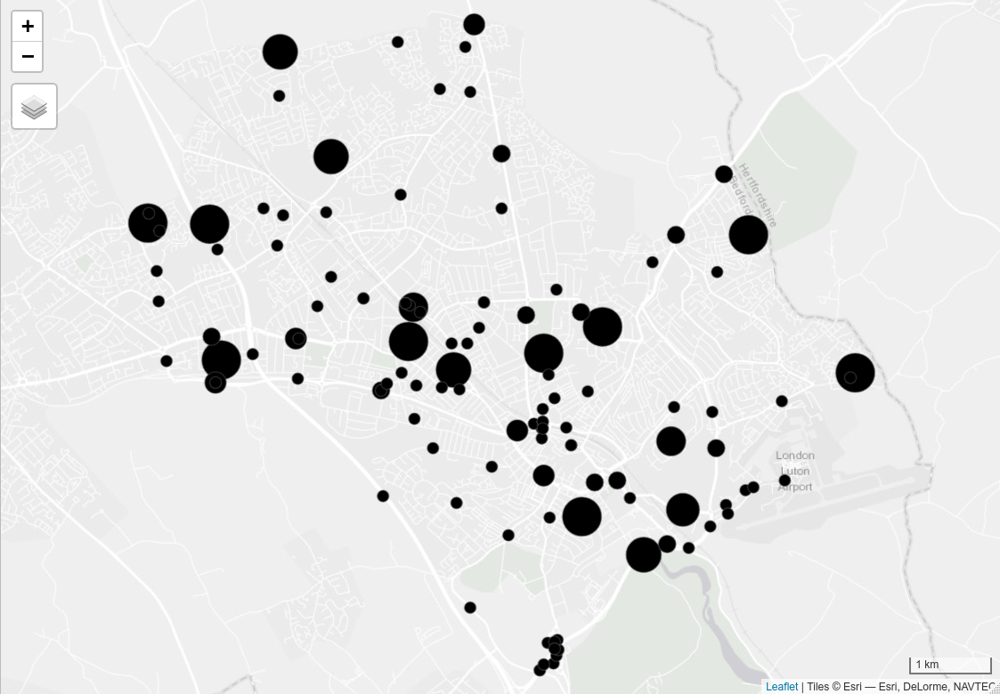
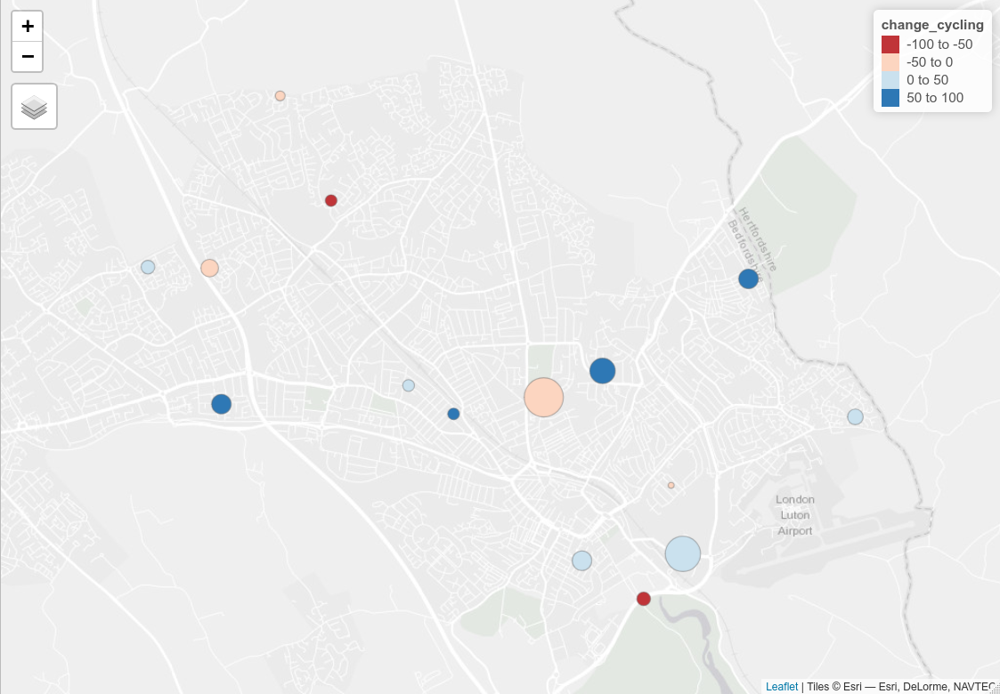

```{r setup, include=FALSE}
knitr::opts_chunk$set(
  cache = TRUE,
  echo = FALSE,   
  # eval = FALSE,
  collapse = TRUE,
  comment = "#>",
  message = FALSE,
  warning = FALSE
  )
```

```{r, echo=FALSE, eval=FALSE}
# set-up
browseURL("~/onedrive/projects-all/stars/report3-140121.docx")
pagedown::chrome_print("report3.html")
browseURL("report3.pdf")
```


<!-- # Introduction -->

```{r, eval=TRUE, include=FALSE}
source("scripts/combined.R")
# file.edit("scripts/combined.R")
source("scripts/counter-data.R")
# file.edit("scripts/counter-data.R")
# source("scripts/gap-analysis.R") # don't run as slow and clunky
```

# Combined network data

In Phase 2 of the project we developed a method to estimate cycling potential to stations based on commuting data.
In this phase we have added two additional layers to this result: 

- Cycling potential for single stage travel to school journeys
- Cycling potential to work for single stage commutes

Results from the longer-term 'Go Dutch' scenario from the Propensity to Cycle Tool, which represents a future in which people cycle as much as the Dutch to accounting for distance and hilliness [@lovelace_propensity_2017], are presented in this report, matching the long-term ambitions in Luton's Local Cycling and Walking Infrastructure Plan.
Go Dutch was also deemed an appropriate scenario because, as described in the emerging Luton Transport Strategy, 50% of journeys to work are less than 5 kilometres but about 55% of these are by car.

Summary statistics of the route network data, showing the relative importance of commute, school and travel to stations trips for potential, are shown in Table \@ref(tab:sumtabthousands).
This headline result suggests that there is an opportunity to significantly increase the number of cycle trips, consistent with the 'Go Dutch' scenario.
under the Go Dutch scenario) and current, for commute and school travel.

```{r sumtabthousands}
knitr::kable(sumtab_thousands, caption = "Relative importance of different trip purposes for cycling potential in local authorities in Bedfordshire. Cycling potential and current (2011 data, a proxy for current cycling levels) cycling levels is measured in thousand km cycled on the network for a typical work/school day (one way).")
```

The distinctive spatial distribution of each network in Luton is shown in Figure \@ref(fig:distribution).^[
See
<!-- [ -->
rpubs.com/RobinLovelace/695521
<!-- ](https://rpubs.com/RobinLovelace/695521) -->
for interactive version.
]
The focus of this report is on Luton because, whilst none of the three Councils have an adopted LCWIP, Luton has started the preparing one and formally consulted the Luton and Dunstable Cycle Forum and the Central Bedfordshire and Luton Joint  Local Access Forum on a draft of the Plan in Spring 2020.
In addition, many of the cycle routes to Luton’s three rail stations proposed in the Stage 2 report of this commission have been included in their Tranche 2 Active Travel Plan funding submission to the DfTand will be delivered during 2021.


```{r distribution, fig.cap="Interactive facetted map of cycling potential for different trip purposes in Luton under the Go Dutch scenario."}
tmap_mode("plot")
luton_hr = sf::read_sf("luton-houghton-regis-region.geojson")
bb = sf::st_bbox(luton_hr)
tm_shape(rnet_all, bbox = bb) +
  tm_lines("dutch_slc", palette = "viridis", lwd = 2, breaks = brks, colorNA = NULL) +
  tm_facets(by = "layer") +
  tm_layout(legend.width = 0.1,
    legend.outside.position = "bottom",
    legend.stack = "horizontal"
    )
```

By combining and aggregating these three separate layers we could create, for the first time, a cycle network representing the combined potential of cycling to school, cycling to work and cycling to stations under scenarios of change.
The combined layer under the Go Dutch scenario is shown in Figure \@ref(fig:combined) (see [rpubs.com/RobinLovelace/695513](https://rpubs.com/RobinLovelace/695513) for interactive version of map).

```{r combined, fig.cap="Cycling potential in Luton: combined commute, school and stations layers."}
# knitr::include_graphics("https://user-images.githubusercontent.com/1825120/100157908-40677100-2ea3-11eb-8de7-445adfc3ecef.png")
tm_shape(rnet_combined, bbox = bb) +
  tm_lines("dutch_slc", palette = "viridis", lwd = 2, breaks = brks, colorNA = NULL) 
```

# Gap analysis

The cycle network is illustrated in Figure \@ref(fig:luton-cycleways-2020) (see [here](https://rpubs.com/RobinLovelace/701619) for interactive version).
Visual analysis of this data can identify potential gaps in provision.
Four areas/corridors can be identified:

1. Hightown Road and the surrounding area
2. Just South and Southwest of the town centre (New Town and Farley Hill)
3. Between Luton and Leagrave North of the busway route
4. The hospital and surrounding area

Improving provision in these areas, and other areas with limited cycling/walking access, may be necessary to increase active travel.
Equally important is links *between* the zones, e.g. with the following links:

- An arterial route up Hightown Road (in recent plans)
- Improved route to the hospital and East-West connections between Dunstable, Leagrave and surrounding areas
- Connections to the busway route: while the route is high quality, it may not be well signposted and lacking clear cycle route onto it from some areas, improving connectivity through signposting to existing connections (perhaps with filtered permeability interventions) and creating new connections could add value to this existing route
- Connections between all residential areas and trip attractors including Luton town centre, the airport and schools
- Crossings to at major barriers including the ring road

```{r}
osm_cycle_infra = readRDS("osm_cycle_infra_bedfordshire.Rds")
osm_cycle_luton = osm_cycle_infra[region_luton, , op = sf::st_within]
all_cycleways = sf::read_sf("SHAPE_FILES_FOR_SUPPLY_TO_LUTON/UNDER_ROAD_off_Road.shp")
# mapview::mapview(all_cycleways)
# tmap_mode("view")
# table(all_cycleways$CyclNm)
# tm_shape(osm_cycle_luton) +
#   tm_lines() +
#   tm_shape(all_cycleways) +
#   tm_lines("CyclNm", lwd = 5, palette = "Set1") +
#   tm_shape(osm_cycle_luton) +
#   tm_lines() +
#   tm_scale_bar()
# file.copy("~/Pictures/Selection_287.png", "figures/")
```

```{r luton-cycleways-2020, fig.cap="The cycle network in Luton (data from 2019). Coloured lines are the routes on the official network. Thin black lines represent data on OpenStreetMap. See interactive version at https://rpubs.com/RobinLovelace/718384."}
knitr::include_graphics("figures/Selection_287.png")
```

# Comparison between potential and routes

A quantitative comparison of the cycling potential levels shown in Section 1 and the cycleways shown in the previous section can help further identify missing links.


```{r missing-map, fig.cap="Missing links, identified based on existing network and cycleways."}
all_cycleways_30m_buffer = sf::st_buffer(sf::st_union(all_cycleways), dist = 30) 
rnet_osgb = sf::st_transform(rnet_all[zones_luton, ], 27700)
# plot(rnet_osgb$geometry)
# plot(all_cycleways_30m_buffer, border = "red", add = TRUE)
rnet_missing = sf::st_difference(rnet_osgb, all_cycleways_30m_buffer)
rnet_missing_high = rnet_missing %>% filter(dutch_slc > 300)
rnet_missing_high$group = stplanr::rnet_group(rnet_missing_high)
rnet_missing_high$length = stplanr::geo_length(rnet_missing_high)
rnet_missing_grouped = rnet_missing_high %>% 
  group_by(group) %>% 
  mutate(group_length = sum(length))
rnet_missing_long = rnet_missing_grouped %>% 
  filter(group_length > 500)
rnet_missing_short = rnet_missing_grouped %>% 
  filter(group_length < 500)
rnet_missing_short_touching = rnet_missing_short[all_cycleways_30m_buffer, ]
rnet_missing_gaps = rbind(rnet_missing_long, rnet_missing_short_touching)
tmap_mode("plot")
brks = c(0, 100, 500, 1000, 5000)
tm_shape(rnet_missing) +
  tm_lines(col = "dutch_slc", palette = "Blues", breaks = brks, lwd = 1) +
  # tm_shape(rnet_missing %>% filter(dutch_slc > 300)) +
  tm_shape(rnet_missing_gaps) +
  tm_lines(col = "red", lwd = 2) +
  tm_shape(all_cycleways_30m_buffer) +
  tm_polygons() +
  tm_scale_bar()
```


# Analysis of counter data

We analysed DfT's manual traffic count data for the study region to trends in motor and cycling traffic.
The locations of 118 DfT count points within Luton are shown in Figure \@ref(fig:counters-all).^[
These count points can also be found at [roadtraffic.dft.gov.uk/](https://roadtraffic.dft.gov.uk/#15/51.8787/-0.4200/basemap-countpoints).
]

```{r counters-all, fig.cap="All count points in Luton, with size proportional to the number of counts recorded in the 10 years from 2010 to 2019 (with the largest dots representing 10 counts on every year)."}

```

Of those counters, only 32 had cycle counts within the years 2010:2014 and 2015:2019, allowing estimates of the trend in cycling in different parts of Luton to be calculated.
The percentage change in cycling calculated from this analysis are presented for each count point for which there is data in Figure \@ref(fig:counters-cycle) (see [here](https://rpubs.com/RobinLovelace/701347) for interactive version).
The results show a mixed picture, reflecting the low signal-to-noise ratio of DfT's manual counts which can be affected by many factors including the weather on the days sampled each year (not adjusted).


```{r counters-cycle, fig.cap="Percentage change in cycling between the periods 2010:2014 and 2015:2019 at counter locations for which at least two readings are available in each period (reds represent decreased cycling, blues represent increased cycling). Size of dot is proportional to the total number of cycles counted at each sampling location, with a maximum value of 788."}

```

As shown in Figure \@ref(fig:pois), even points that have recorded substantial amounts of cycle traffic have not recorded data every year, as illustrated by a couple of individual counters.
The counter on Old Bedford Road next to The Peoples Park (id 941693) has seen a slight decline in cycling over the last 10 years, and the counter on Kimpton Road near Luton Airport Parkway rail station (951632) has seen a slight increase in cycling.

```{r pois, fig.cap="Results from two individual counters showing the sparsity of DfT manual count data."}
count_points_of_interest = c("941693", "951632")
d_roads_luton_all %>% 
  filter(count_point_id %in% count_points_of_interest) %>% 
  filter(estimation_method == "Counted") %>% 
  ggplot() +
  geom_line(aes(year, pedal_cycles)) +
  geom_point(aes(year, pedal_cycles)) +
  facet_grid(rows = vars(count_point_id)) +
  scale_x_continuous(breaks = 2010:2019)
```

Individual count points cannot provide a reliable indication of trends but aggregated data, from all available count points in the area, provide an indication of trends.
Results aggregated to the road on which readings were taken (with C and U representing unclassified roads) are shown in Figure \@ref(fig:roadcounts).
This suggests a slight decline in cycling in Luton since around 2015, at least on the sparse DfT cycle count point network.

```{r roadcounts, fig.cap="Mean cycle counts per year aggregated at the road level. The thick blue line represents the overall trend."}
d_roadss %>% 
  ggplot() +
  geom_line(aes(year, pedal_cycles, group = road_name, colour = road_name)) +
  geom_smooth(aes(year, pedal_cycles), size = 3, fill = NA) 
```

In contrast with the results shown in Figure \@ref(fig:roadcounts), there is evidence of consistent growth in motor traffic in Luton and indeed most local authorities, with relative levels of traffic per KM road in Bedfordshire local authorities shown alongside trendlines for all local authorities in Figure \@ref(fig:trafficgrowth).

```{r trafficgrowth, fig.cap="Levels of motor traffic per km of road network per year for local authorities in Great Britain, with Bedfordshire local authorities highlighted."}
d_las %>% 
  ggplot() +
  geom_line(aes(year, relative_traffic, group = local_authority_name), colour = "grey") +
  geom_line(aes(year, relative_traffic, colour = local_authority_name), data = d_las_of_interest, size = 1.2) +
  theme(legend.position = "top")
```

Changes in motor traffic levels between 2011 and 2019 in the region are summarised in Table \@ref(tab:netlen). 

```{r netlen}
knitr::kable(d_change, caption = "Network length and change in motor traffic between 2011 and 2019 for Bedfordshire regions")
```


<!-- Idea: could be a methods paper -->

# References

