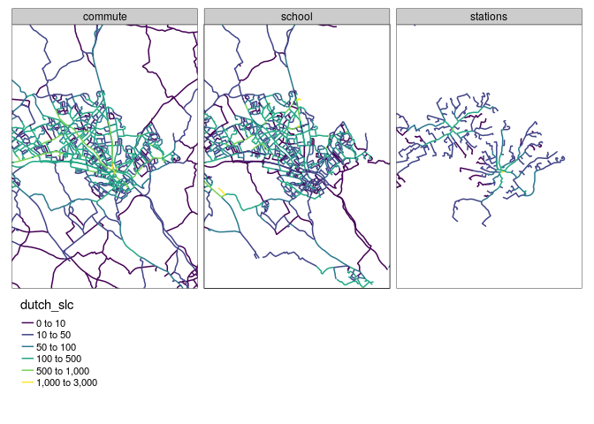
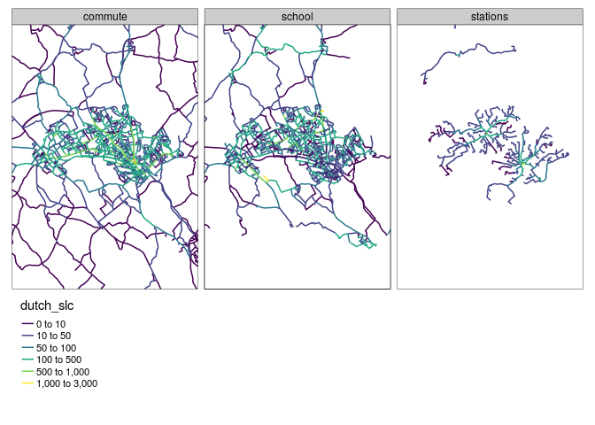

STARS Phase 3 Report: Evidence to support long-term network plans
================
Joey Talbot & Robin Lovelace
December 2020

<!-- # Introduction -->

# 1 Analysis of counter data

<!-- -->

| local\_authority\_name | network\_length\_km | change\_2011 |
|:-----------------------|--------------------:|-------------:|
| Bedford                |            911.0743 |     1.277328 |
| Central Bedfordshire   |           1496.0911 |     1.277508 |
| Luton                  |            452.6636 |     1.145657 |

Table 1.1: Network length and change in motor traffic between 2011 for
Bedfordshire regions

# 2 Combined network data

The combined layer is shown in Figure <a href="#fig:combined">2.1</a>
(see
[rpubs.com/RobinLovelace/695513](https://rpubs.com/RobinLovelace/695513)
for interactive version of map).

Figure 2.1: Cycling potential in Luton: combined commute, school and
stations layers.

Summary statistics of the route network data, showing the relative
importance of commute, school and travel to stations trips for potential
(under the Go Dutch scenario) and current (for commute and school
travel) is shown in Table <a href="#tab:sumtabthousands">2.1</a>.

| lad\_name            | commute | school | stations | all | commute\_2011 | school\_2011 |
|:---------------------|--------:|-------:|---------:|----:|--------------:|-------------:|
| Bedford              |     407 |    244 |       18 | 669 |            69 |           17 |
| Central Bedfordshire |     242 |    314 |       26 | 583 |            28 |            9 |
| Luton                |     413 |    293 |       34 | 740 |            30 |            4 |

Table 2.1: Relative importance if different trip purposes for cycling
potential in local authorities in Bedfordshire. Cycling potential and
current (2011 data, a proxy for current cycling levels) cycling levels
is measured in thousand km cycled on the network for a typical
work/school day (one way).

The spatial distribution of each network is shown in Figure
<a href="#fig:distribution">2.2</a>.[1]

Figure 2.2: Interactive facetted map of cycling potential for different
trip purposes in Luton under the Go Dutch scenario.

## 2.1 Gap analysis on the network

[1]  See
[rpubs.com/RobinLovelace/695521](https://rpubs.com/RobinLovelace/695521)
for interactive version.
