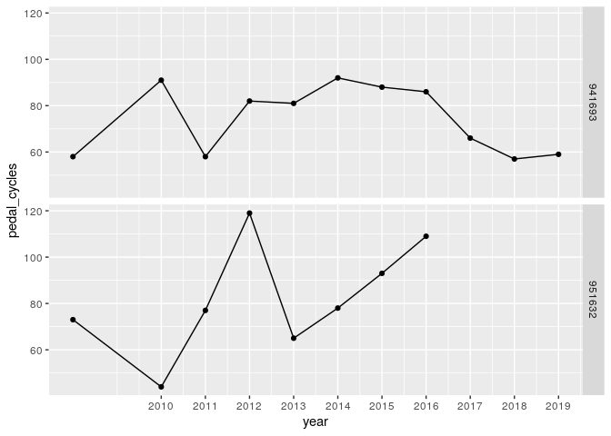
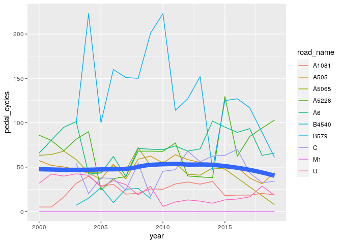
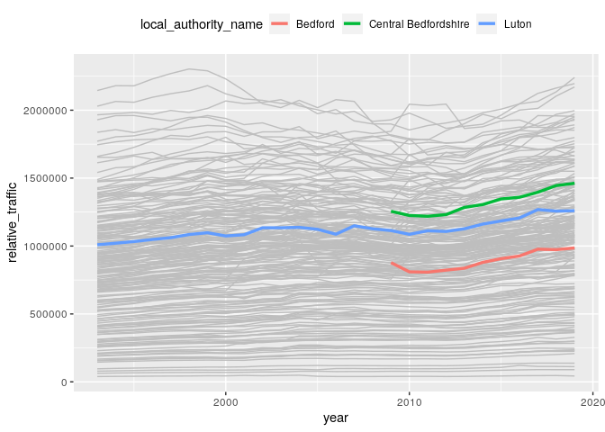

STARS Phase 3 Report: Evidence to support long-term network plans
================
Joey Talbot & Robin Lovelace
December 2020

<!-- # Introduction -->

# 1 Combined network data

In Phase 2 of the project we developed a method to estimate cycling
potential to stations based on commuting data. In this phase we have
added two additional layers to this result:

-   Cycling potential for single stage travel to school journeys
-   Cycling potential to work for single stage commutes

Summary statistics of the route network data, showing the relative
importance of commute, school and travel to stations trips for potential
(under the Go Dutch scenario) and current (for commute and school
travel) is shown in Table <a href="#tab:sumtabthousands">1.1</a>.

| lad\_name            | commute | school | stations | all | commute\_2011 | school\_2011 |
|:---------------------|--------:|-------:|---------:|----:|--------------:|-------------:|
| Bedford              |     407 |    244 |       18 | 669 |            69 |           17 |
| Central Bedfordshire |     242 |    314 |       26 | 583 |            28 |            9 |
| Luton                |     413 |    293 |       34 | 740 |            30 |            4 |

Table 1.1: Relative importance if different trip purposes for cycling
potential in local authorities in Bedfordshire. Cycling potential and
current (2011 data, a proxy for current cycling levels) cycling levels
is measured in thousand km cycled on the network for a typical
work/school day (one way).

The distinctive spatial distribution of each network in Luton is shown
in Figure <a href="#fig:distribution">1.1</a>.[1]

Figure 1.1: Interactive facetted map of cycling potential for different
trip purposes in Luton under the Go Dutch scenario.

By combining and aggregating these three separate layers we could
create, for the first time, a cycle network representing the combined
potential of cycling to school, cycling to work and cycling to stations
under scenarios of change. The combined layer under the Go Dutch
scenario is shown in Figure <a href="#fig:combined">1.2</a> (see
[rpubs.com/RobinLovelace/695513](https://rpubs.com/RobinLovelace/695513)
for interactive version of map).

Figure 1.2: Cycling potential in Luton: combined commute, school and
stations layers.

# 2 Analysis of counter data

We analysed DfT’s manual traffic count data for the study region to
trends in motor and cycling traffic. The locations of 118 DfT count
points within Luton are shown in Figure
<a href="#fig:counters-all">2.1</a>.[2]

Figure 2.1: All count points in Luton, with size proportional to the
number of counts recorded in the 10 years from 2010 to 2019 (with the
largest dots representing 10 counts on every year).

Of those counters, only 32 had cycle counts within the years 2010:2014
and 2015:2019, allowing estimates of the trend in cycling in different
parts of Luton to be calculated. The percentage change in cycling
calculated from this analysis are presented for each count point for
which there is data in Figure <a href="#fig:counters-cycle">2.2</a> (see
[here](https://rpubs.com/RobinLovelace/701347) for interactive version).
The results show a mixed picture, reflecting the low signal-to-noise
ratio of DfT’s manual counts which can be affected by many factors
including the weather on the days sampled each year (not adjusted).

Figure 2.2: Percentage change in cycling between the periods 2010:2014
and 2015:2019 at counter locations for which at least two readings are
available in each period (reds represent decreased cycling, blues
represent increased cycling). Size of dot is proportional to the total
number of cycles counted at each sampling location.

As shown in Figure <a href="#fig:pois">2.3</a>, even points that have
recorded substantial amounts of cycle traffic have not recorded data
every year, as illustrated by a couple of individual counters. The
counter on Old Bedford Road next to The Peoples Park (id 941693) has
seen a slight decline in cycling over the last 10 years, and the counter
on Kimpton Road near Luton Airport Parkway rail station (951632) has
seen a slight increase in cycling.

Figure 2.3: Results from two individual counters showing the sparsity of
DfT manual count data.

Individual count points cannot provide a reliable indication of trends
but aggregated data, from all available count points in the area,
provide an indication of trends. Results aggregated to the road on which
readings were taken (with C and U representing unclassified roads) are
shown in Figure <a href="#fig:roadcounts">2.4</a>. This suggests a
slight decline in cycling in Luton since around 2015, at least on the
sparse DfT cycle count point network.

Figure 2.4: Mean cycle counts per year aggregated at the road level. The
thick blue line represents the overall trend.

In contrast with the results shown in Figure
<a href="#fig:roadcounts">2.4</a>, there is evidence of consistent
growth in motor traffic in Luton and indeed most local authorities, with
relative levels of traffic per KM road in Bedfordshire local authorities
shown alongside trendlines for all local authorities in Figure
<a href="#fig:trafficgrowth">2.5</a>.

Figure 2.5: Levels of motor traffic per km of road network per year for
local authorities in Great Britain, with Bedfordshire local authorities
highlighted.

Changes in motor traffic levels between 2011 and 2019 in the region are
summarised in Table <a href="#tab:netlen">2.1</a>.

| local\_authority\_name | network\_length\_km | change\_2011 |
|:-----------------------|--------------------:|-------------:|
| Bedford                |                 911 |        1.277 |
| Central Bedfordshire   |                1496 |        1.278 |
| Luton                  |                 453 |        1.146 |

Table 2.1: Network length and change in motor traffic between 2011 for
Bedfordshire regions

# 3 Gap analysis on the network

<!-- Idea: could be a methods paper -->

# 4 References

[1]  See
[rpubs.com/RobinLovelace/695521](https://rpubs.com/RobinLovelace/695521)
for interactive version.

[2]  These count points can also be found at
[roadtraffic.dft.gov.uk/](https://roadtraffic.dft.gov.uk/#15/51.8787/-0.4200/basemap-countpoints).
