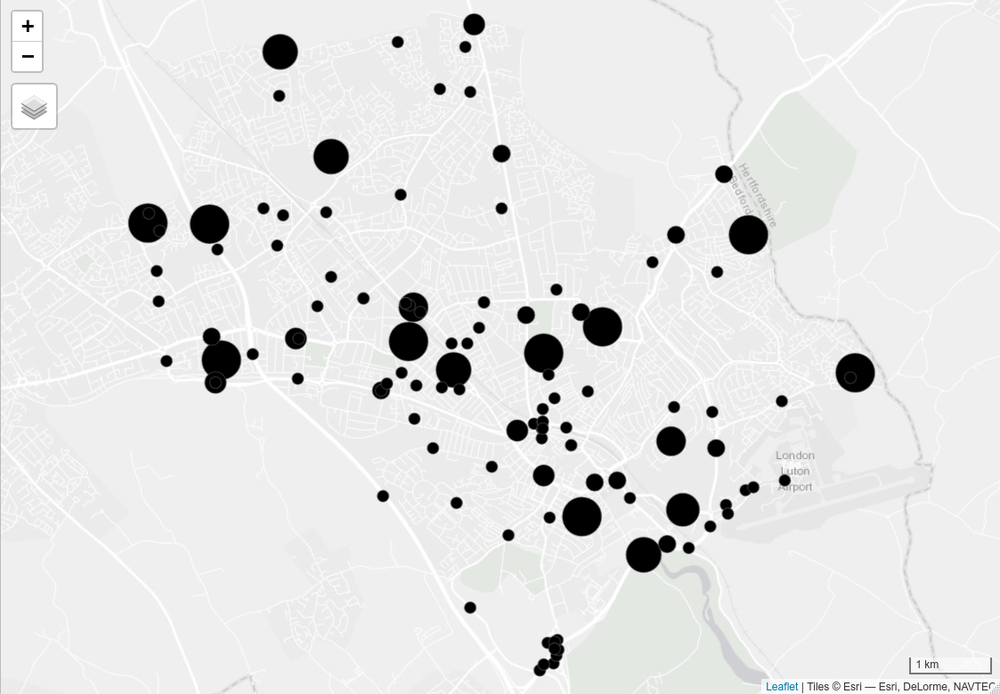

STARS Phase 3 Report: Evidence to support long-term network plans
================
Robin Lovelace & Joey Talbot
December 2020

<!-- # Introduction -->

# 1 Combined network data

In Phase 2 of the project we developed a method to estimate cycling
potential to stations based on commuting data. In this phase we have
added two additional layers to this result:

-   Cycling potential for single stage travel to school journeys,
    documented in (Goodman et al. 2019)
-   Cycling potential to work for single stage commutes

Results from the longer-term ‘Go Dutch’ scenario from the Propensity to
Cycle Tool, which represents a future in which people cycle as much as
the Dutch to accounting for distance and hilliness (Lovelace et al.
2017), are presented in this report, matching the long-term ambitions in
Luton’s Local Cycling and Walking Infrastructure Plan. Go Dutch was also
deemed an appropriate scenario because, as described in the emerging
Luton Transport Strategy, 50% of journeys to work are less than 5
kilometres but about 55% of these are by car.

Summary statistics of the route network data, showing the relative
importance and potential of commute, school and travel-to-rail trips,
are shown in Table <a href="#tab:sumtabthousands">1.1</a>. Note that the
figures for cycling to rail stations only include commuter journeys to
rail stations. Across the East of England, in 2018/2019 only 13% of
trips were for the purpose of commuting according to the [National
Travel
Survey](https://www.gov.uk/government/statistical-data-sets/nts04-purpose-of-trips),
thus total cycle-to-rail potential will be higher.

The headline comparison between the ‘Go Dutch’ cycling potentials for
travel to work, school and rail stations, and the 2011 data on travel to
work and school, suggests that there is an opportunity to significantly
increase the number of cycle trips. The ‘Go Dutch’ cycling potentials in
the three Local Authorities are an order of magnitude higher than the
existing (2011) numbers of cycle journeys.

| lad\_name            | commute | school | stations | all | commute\_2011 | school\_2011 |
|:---------------------|--------:|-------:|---------:|----:|--------------:|-------------:|
| Bedford              |     407 |    244 |       18 | 669 |            69 |           17 |
| Central Bedfordshire |     242 |    314 |       26 | 583 |            28 |            9 |
| Luton                |     413 |    293 |       34 | 740 |            30 |            4 |

Table 1.1: Relative importance of different trip purposes for cycling
potential in local authorities in Bedfordshire. Cycling potential under
a ‘Go Dutch’ scenario and current (2011 data, a proxy for current
cycling levels) cycling levels are measured in thousand km cycled on the
network for a typical work/school day (one way).

The distinctive spatial distribution of each network in Luton is shown
in Figure <a href="#fig:distribution">1.1</a>.[1] The focus of this
report is on the Luton/Dunstable Urban Area because, whilst none of the
three Councils have an adopted LCWIP, Luton has started the preparing
one and formally consulted the Luton and Dunstable Cycle Forum and the
Central Bedfordshire and Luton Joint Local Access Forum on a draft of
the Plan in Spring 2020. In addition, many of the cycle routes to
Luton’s three rail stations proposed in the Stage 2 report of this
commission have been included in their Tranche 2 Active Travel Plan
funding submission to the DfTand will be delivered during 2021. We can
also see from the data in Table <a href="#tab:sumtabthousands">1.1</a>
that the relative difference between 2011 cycling levels and ‘Go Dutch’
cycling potentials is greater in Luton than in Bedford or Central
Bedfordshire, thus Luton has the greatest potential for future increases
in cycling uptake.

Figure 1.1: Facetted map of cycling potential for different trip
purposes in Luton under the Go Dutch scenario.

By combining and aggregating these three separate layers we could
create, for the first time, a cycle network representing the combined
potential of cycling to school, cycling to work and cycling to stations
under scenarios of change. The combined layer under the Go Dutch
scenario is shown in Figure <a href="#fig:combined">1.2</a> (see
[rpubs.com/RobinLovelace/695513](https://rpubs.com/RobinLovelace/695513)
for interactive version of map).

Figure 1.2: Cycling potential in Luton: combined commute, school and
stations layers.

# 2 Gap analysis

The cycle network is illustrated in Figure
<a href="#fig:luton-cycleways-2020">2.1</a> (see
rpubs.com/RobinLovelace/701619 for interactive version). Visual analysis
of this data can identify potential gaps in provision. Four
areas/corridors can be identified:

1.  High Town Road and the surrounding area
2.  Just South and Southwest of the town centre (New Town and Farley
    Hill)
3.  Between Luton and Leagrave north of the busway route
4.  The hospital and surrounding area

Improving provision in these areas, and other areas with limited
cycling/walking access, may be necessary to increase active travel.
Equally important is links *between* the zones, e.g. with the following
links:

-   An arterial route up High Town Road (in recent plans)
-   Improved route to the hospital and East-West connections between
    Dunstable, Leagrave and surrounding areas
-   Connections to the busway route: while the route is high quality, it
    may lack clear cycle links onto it from some areas. Improving
    connectivity through signposting to existing connections (perhaps
    with filtered permeability interventions) and creating new
    connections could add value to this existing route
-   Connections between all residential areas and trip attractors
    including Luton town centre, the airport and schools
-   Crossings at major barriers including the ring road around Luton
    town centre (as mentioned in relation to walking in LCWIP report)

Figure 2.1: The cycle network in Luton (data from 2019). Coloured lines
are the routes on the official network. Thin black lines represent data
on OpenStreetMap. See interactive version at
rpubs.com/RobinLovelace/718384.

# 3 Comparison between potential and routes

A quantitative comparison of the cycling potential levels shown in
Section 1 and the cycleways shown in the previous section can help
further identify missing links. Here we use the combined route network
of travel to work, school and rail stations. Routes with &gt; 300
cyclists on this combined route network and without existing cycle
infrastructure are highlighted as ‘missing links’ in
<a href="#fig:missing-map">3.1</a>.

Figure 3.1: Missing links, identified based on existing network and
cycleways. Existing cycle infrastructure is shown in grey and missing
links are shown in red.

# 4 Analysis of counter data

We analysed DfT’s manual traffic count data for the study region to
trends in motor and cycling traffic. The locations of 118 DfT count
points within Luton are shown in Figure
<a href="#fig:counters-all">4.1</a>.[2]

Figure 4.1: All count points in Luton, with size proportional to the
number of counts recorded in the 10 years from 2010 to 2019 (with the
largest dots representing 10 counts on every year).

Of those counters, only 32 had cycle counts within the years 2010:2014
and 2015:2019, allowing estimates of the trend in cycling in different
parts of Luton to be calculated. The percentage change in cycling
calculated from this analysis are presented for each count point for
which there is data in Figure <a href="#fig:counters-cycle">4.2</a> (see
rpubs.com/RobinLovelace/701347 for interactive version). The results
show a mixed picture, reflecting the low signal-to-noise ratio of DfT’s
manual counts which can be affected by many factors including the
weather on the days sampled each year (not adjusted).

Figure 4.2: Percentage change in cycling between the periods 2010:2014
and 2015:2019 at counter locations for which at least two readings are
available in each period (reds represent decreased cycling, blues
represent increased cycling). Size of dot is proportional to the total
number of cycles counted at each sampling location, with a maximum value
of 788.

As shown in Figure <a href="#fig:pois">4.3</a>, even points that have
recorded substantial amounts of cycle traffic have not recorded data
every year, as illustrated by a couple of individual counters. The
counter on Old Bedford Road next to The Peoples Park (id 941693) has
seen a slight decline in cycling over the last 10 years, and the counter
on Kimpton Road near Luton Airport Parkway rail station (951632) has
seen a slight increase in cycling.

Figure 4.3: Results from two individual counters showing the sparsity of
DfT manual count data.

Individual count points cannot provide a reliable indication of trends
but aggregated data, from all available count points in the area,
provide an indication of trends. Results aggregated to the road on which
readings were taken (with C and U representing unclassified roads) are
shown in Figure <a href="#fig:roadcounts">4.4</a>. This suggests a
slight decline in cycling in Luton since around 2015, at least on the
sparse DfT cycle count point network.

Figure 4.4: Mean cycle counts per year aggregated at the road level. The
thick blue line represents the overall trend.

In contrast with the results shown in Figure
<a href="#fig:roadcounts">4.4</a>, there is evidence of consistent
growth in motor traffic in Luton and indeed most local authorities, with
relative levels of traffic per KM road in Bedfordshire local authorities
shown alongside trendlines for all local authorities in Figure
<a href="#fig:trafficgrowth">4.5</a>.

Figure 4.5: Levels of motor traffic per km of road network per year for
local authorities in Great Britain, with Bedfordshire local authorities
highlighted.

Changes in motor traffic levels between 2011 and 2019 in the region are
summarised in Table <a href="#tab:netlen">4.1</a>.

| local\_authority\_name | network\_length\_km | change\_2011 |
|:-----------------------|--------------------:|-------------:|
| Bedford                |                 911 |        1.277 |
| Central Bedfordshire   |                1496 |        1.278 |
| Luton                  |                 453 |        1.146 |

Table 4.1: Network length and change in motor traffic between 2011 and
2019 for Bedfordshire regions

<!-- Idea: could be a methods paper -->

# 5 References

Goodman, Anna, Ilan Fridman Rojas, James Woodcock, Rachel Aldred,
Nikolai Berkoff, Malcolm Morgan, Ali Abbas, and Robin Lovelace. 2019.
“Scenarios of Cycling to School in England, and Associated Health and
Carbon Impacts: Application of the ‘Propensity to Cycle Tool’.” *Journal
of Transport & Health* 12 (March): 263–78.
<https://doi.org/10.1016/j.jth.2019.01.008>.

Lovelace, Robin, Anna Goodman, Rachel Aldred, Nikolai Berkoff, Ali
Abbas, and James Woodcock. 2017. “The Propensity to Cycle Tool: An Open
Source Online System for Sustainable Transport Planning.” *Journal of
Transport and Land Use* 10 (1). <https://doi.org/10.5198/jtlu.2016.862>.

[1]  See <!-- [ --> rpubs.com/RobinLovelace/695521
<!-- ](https://rpubs.com/RobinLovelace/695521) --> for interactive
version.

[2]  These count points can also be found at roadtraffic.dft.gov.uk
<!-- These count points can also be found at [roadtraffic.dft.gov.uk/](https://roadtraffic.dft.gov.uk/#15/51.8787/-0.4200/basemap-countpoints) -->
