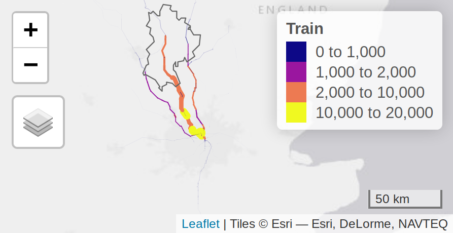
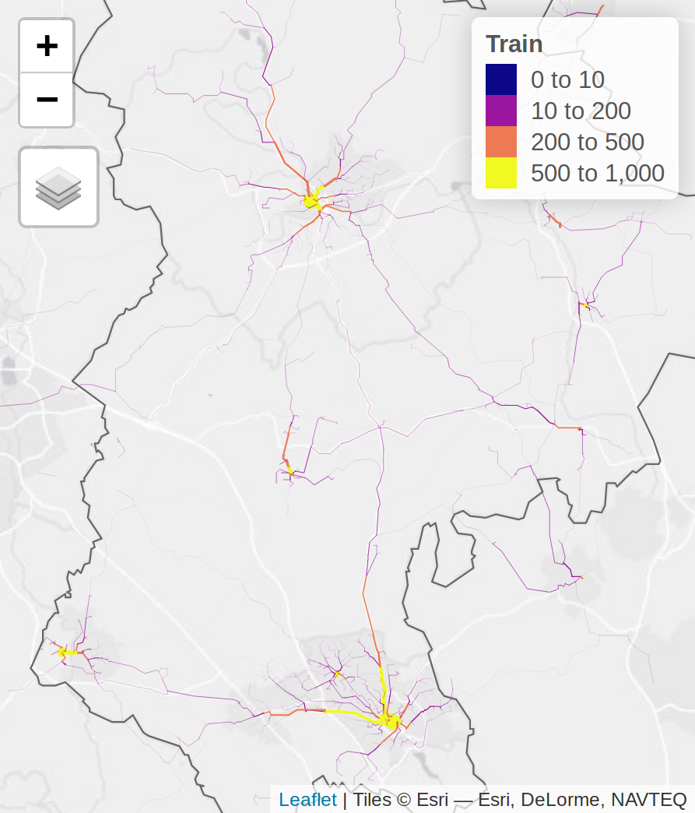
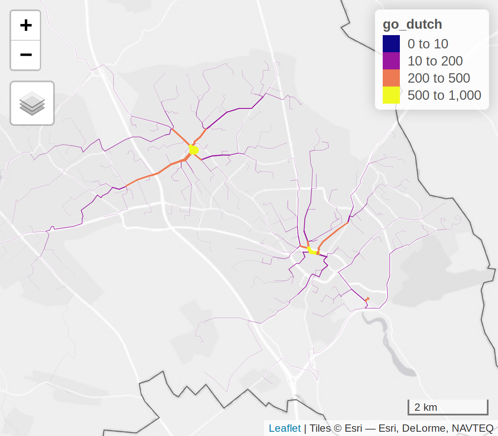
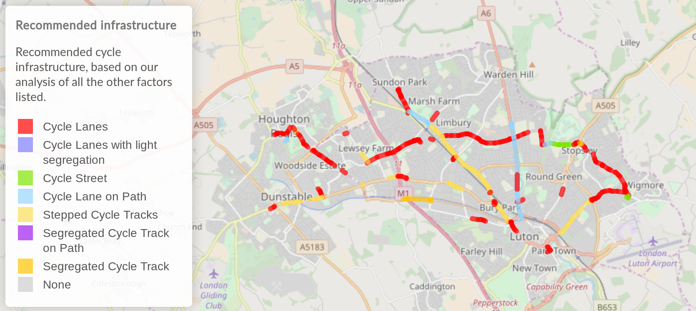

```{r, include=FALSE}
knitr::opts_chunk$set(echo = FALSE)
library(tidyverse)
```


# Introduction

- Incorporating school journeys into the Propensity to Cycle Tool (PCT)

- STARS - sustainable transport access to rail stations

- ACTON - Active transport options for new developments


---

# Schools


---

# Vector and raster representations at a regional scale

.pull-left[

```{r}
knitr::include_graphics("~/pct-commute-schools-overlay/combined_rnet_leeds_centre.png")
```

]

--

.pull-right[

```{r}
knitr::include_graphics("~/pct-commute-schools-overlay/rnet_commute.png")
```

]

---

# Vector and raster representations of Leeds city centre

```{r combi2, out.width="33%", fig.show='hold', fig.cap="The vector route network, 100m and 200m resolution raster images for the centre of Leeds, showing the combined commute/school travel networks."}
# i = magick::image_read("200m_clxm_leeds_centre.png")
# i_border = magick::image_border(image = i, color = "white", geometry = "10x10")
# i_border
# magick::image_write(i_border, "200m_clxm_leeds_centre.png")
knitr::include_graphics(c("~/pct-commute-schools-overlay/combined_rnet_leeds_centre.png", "~/pct-commute-schools-overlay/100m_clxm_leeds_centre.png", "200m_clxm_leeds_centre.png"))
```

---

# Schools and residential zones

```{r combi3, out.height="6.5cm", fig.show='hold', fig.cap="The location of schools, residential areas, and heavily used routes to schools in the Leeds and Bradford area. "}
knitr::include_graphics(c("~/pct-commute-schools-overlay/schools_and_lsoa.png","~/pct-commute-schools-overlay/routes-schools-res.png"))
```

---

# Connected networks of routes to schools

```{r rnet-membership, out.width="50%", fig.show='hold', fig.cap="Route networks with high cycle to school potential (100+ trips per day under Go Dutch) grouped by connectivity, with the largest 4 groups in terms of number of segments highlighted by colour (left). A zoomed-in view of the second largest group."}
knitr::include_graphics(c("~/pct-commute-schools-overlay/Plots/rnet-membership-4-groups.png","~/pct-commute-schools-overlay/Plots/rnet-group2.png"))
```

---

# Combining schools and commute networks

``` {r faceted, out.width="100%", fig.show="hold", fig.cap="Route networks of commute, school, combined and weighted cycle propensity in the 5km zone surrounding Leeds Railway Station. In the weighted panel trips to school are given a weighting of 2."}
knitr::include_graphics("~/pct-commute-schools-overlay/faceted_to_scale.png")
```

---

# Aims of STARS: 

- Establish the potential for cycling to stations in the STARS study area

- Inform investment decisions regarding cycle infrastructure and cycle parking at stations

- Feed into monitoring and evaluation of cycling levels

???

Around 2/3rd of trips are within 5 miles.
Many of these are cyclable, especially when considering Ebikes.
But how to get people cycling who commute longer distances, e.g. those living in the commuter belts outside London?

Modal shift to cycling under future scenarios
Identify roads which may benefit from improved cycle infrastructure
Estimate the number of cycle parking spaces required at stations
Can identify potential monitoring sites and provide a baseline against which to assess cycling uptake 

---

# Case study area - zone analysis

.pull-left[

```{r}
knitr::include_url("../figures/beford-overview-with mainline.png")
```

]

--

.pull-right[

664,000 people in 1,200 km2

Moderate population density (~500 ppl/km2 vs ~400 in England)

Relatively even distribution of stations

For interactive map see [here](http://rpubs.com/RobinLovelace/536607)

Cyclable distances (~3.5 km population-weighted mean to stations)

"train is the only practical method for getting to work for many people" (Phase I report)

]

---

# Mode split for commuting - LA

```{r, message=FALSE}
library(dplyr)
readr::read_csv("../output-data/mode-data-local-authority.csv") %>% 
  knitr::kable(format = "html")
```

---

# Mode split by station catchment

```{r, message=FALSE}
readr::read_csv("../output-data/mode-data-nearest-catchments.csv") %>% 
  knitr::kable(format = "html")
```

---

# Intra-region travel - OD data analysis

.pull-left[

```{r}
knitr::include_graphics("../figures/bedford-intra-region-commutes.png")
```


]

--

.pull-right[

See [here](http://rpubs.com/RobinLovelace/536634) for interactive map

Around half of all commutes are within Bedfordshire

The majority of these are to the nearest town centre, but there is some inter-town travel

]

---

# Existing infrasture

```{r}
knitr::include_graphics("../figures/existing-cyipt.png")
```

See https://www.cyipt.bike/ for full map


???

Worth chatting to Keith/Caroline about

---

# Data sources

- 2011 census data

- 2017-18 ORR Estimates of Station Usage 

- 2018 travel survey of Bedfordshire Midland Main Line stations

- Cyclestreets routing API

- PCT travel to work scenarios

- CyIPT street level cycle infrastructure data

---

.pull-left[

# Methodology


- Identify trips that could be made by cycle/PT combination

- Estimate travel to stations, currently (and potential?)

- Estimate the potential for those trips to be cycled

- Combine with cycling potential for other trip purposes

- Visualise results to inform decision-making process

- Assess specific interventions

]

--

.pull-right[

```{r}
knitr::include_graphics("../figures/multi-stage-rail-schematic.png")
```


```{r}
knitr::include_graphics("../figures/rail_desire_lines.png")
```

]

???

These desire lines show MSOA commute data for all journeys starting in Bedfordshire where at least 20 people travel by rail


---

# Identification of public transport trips

.pull-left[

## Phase I

- Start with Census OD data
- Transport API used to find if trip could arrive by 9:00 AM
- Fastest train journey used (see [here](http://rpubs.com/RobinLovelace/536826))
- Not simply routing cyclists to the nearest station, but takes account of their final destination 

```{r}

```


]

.pull-right[

## Phase II 

- Start with commutes that are already made by rail
- Use OpenTripPlanner to identify shortest overall journey time for cycle/rail combination
- Based on home-rail trip, estimate potential for trip to be cycled


Next steps

- Estimate travel-to-station levels for non commute trips based on local survey data
- Use knowledge of capacity to estimate growth

]

---

# Current trips to stations

.pull-left[

### Phase I estimates

```{r}

```


]


.pull-right[

### Phase II estimates

```{r}
knitr::include_graphics("../figures/bedford-all-phase2.png")
```

]


???

Add figure showing modal share and distance travelled of Bedfordshire commuters.

---

## Cycling potential estimates - Go Dutch

.pull-left[

### Phase I estimates

```{r}
knitr::include_graphics("../figures/bedford-rnet-go-dutch-phase1.png")
```

]


.pull-right[

### Phase II estimates

```{r}

```

]


---

# Cycling takeup rates


```{r}
knitr::include_graphics("../figures/takeup-by-phase.png")
```

---

# Other considerations

Busyness. Interactive map [here](http://rpubs.com/RobinLovelace/536820)

```{r}
knitr::include_graphics("../figures/bedford-busyness.png")
```


---

# Route network analysis

Compare potential with plans - interactive map [online](http://rpubs.com/RobinLovelace/536827)

```{r, out.width="75%"}

```

???

This routes commutes to the major Bedfordshire stations only (as shown in previous slide) using the Cyclestreets routing API and the PCT 'Go Dutch' scenario
Journeys are to the nearest station 'as the crow flies'

---

# Infrastructure options

```{r}

```

---


# Next steps

```{r}
knitr::include_graphics("https://user-images.githubusercontent.com/1825120/66382281-de079480-e9b2-11e9-89b4-159a7022306f.png")
```

--

- Feasibility assessment of route options 
- Explore other interventions
- [Overlay](http://rpubs.com/RobinLovelace/536834) with commuter and educational trip potential
- Create integrated layer of cycling potential
- Extend Phase I cycle parking analysis
- Training / workshop
- National deployment of cycling-transport layer
- calculate with route network distance minimised

---

# ACTON

```{r}
library(tmap)
zones_leeds = sf::read_sf("https://github.com/cyipt/acton/releases/download/0.0.1/zones_leeds_pct_jts_2017_lsoa.geojson")
qtm(zones_leeds, "Empl_pop")
```

---

# Distance from a centre of employment with >=5000 jobs

```{r}
library(tmap)
tmap_mode("plot")
qtm(zones_leeds, c("Jobs5000EmpPTt", "Jobs5000EmpCyct", "Jobs5000EmpCart")) +
  tm_facets(nrow = 1)
```


---

# Weighted distance from centres of employment

```{r}
knitr::include_graphics("~/acton/figures/weighted-access.png")
```


---

class: center, middle

# Thanks + further info

Robin Lovelace: r.lovelace@leeds.ac.uk

Joey Talbot: J.D.Talbot@leeds.ac.uk

For more on the PCT, see www.pct.bike

www.cyipt.bike for the Cycling Infrastructure Prioritisation Toolkit (CyIPT)


