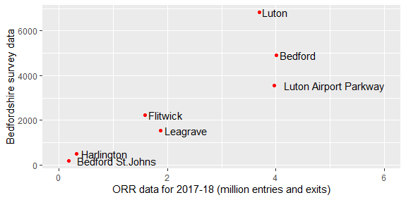
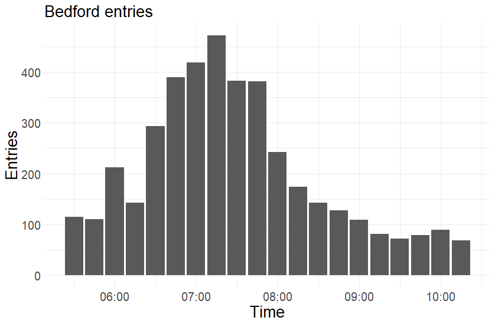

```{r, include=FALSE}
knitr::opts_chunk$set(echo = FALSE)
```


# Introduction

.pull-left[

- About us

- Updating the Propensity to Cycle Tool (PCT)

- The Cycling Infrastructure Prioritisation Toolkit (CyIPT)

- Why travel to stations

]

--

.pull-right[

Aims: 

- Establish the potential for cycling to stations in the STARS study area

- Inform investment decisions regarding cycle infrastructure and cycle parking at stations

- Feed into monitoring and evaluation of cycling levels

]

???

Robin to do this bit

Around 2/3rd of trips are within 5 miles.
Many of these are cyclable, especially when considering Ebikes.
But how to get people cycling who commute longer distances, e.g. those living in the commuter belts outside London?

Modal shift to cycling under future scenarios
Identify roads which may benefit from improved cycle infrastructure
Estimate the number of cycle parking spaces required at stations
Can identify potential monitoring sites and provide a baseline against which to assess cycling uptake 


---

# Case study area

.pull-left[

```{r}
knitr::include_url("../figures/beford-overview-with mainline.png")
```

]

--

.pull-right[

664,000 people in 1,200 km^2^

Moderate population density (~500 ppl/km^2^ vs ~400 in England)

Relatively even distribution of stations

For interactive map see [here](http://rpubs.com/RobinLovelace/536607)

Cyclable distances (~3.5 km population-weighted mean to stations)

]

---

# Existing infrasture

```{r}
knitr::include_graphics("../figures/existing-cyipt.png")
```

See https://www.cyipt.bike/ for full map


???

Worth chatting to Keith/Caroline about

---

# Data sources

- 2011 census data

- 2017-18 ORR Estimates of Station Usage 

- 2018 travel survey of Bedfordshire Midland Main Line stations

- Cyclestreets routing API

- PCT travel to work scenarios

- CyIPT street level cycle infrastructure data

---

# Census travel to work data

Add figure showing modal share and distance travelled of Bedfordshire commuters.

---

# Census travel to work data - rail journeys

```{r}
knitr::include_graphics("../figures/rail_desire_lines.png")
```

???

These desire lines show MSOA commute data for all journeys starting in Bedfordshire where at least 20 people travel by rail

---

# Survey data

To add: summary stats: 
- modal share at each station in bedfordshire. Do we include the Luton stations?
- station usage over time

```{r}

```

---

# Survey data analysis

Luton Airport Parkway is less dominated by commuter journeys than other stations

.pull-left[

```{r}


knitr::include_graphics("../figures/luton-airpt-pkwy-entries.png")
```

]

.pull-right[

```{r}
knitr::include_graphics("../figures/bedford-exits.png")

knitr::include_graphics("../figures/luton-airpt-pkwy-exits.png")
```

]


???

The ORR data is from the Estimates of Station Usage for 2017-18 (the most recent year available)
The survey data is from 27-29th Nov 2018, collected on a single day between the hours of 05:30-10:30am at each station. 
Luton Airport Parkway is not used much for commuting, so we can expect the survey data (collected during the morning peak) to show lower usage than ORR data (representing total annual usage)

---

# Route network analysis

Routes aggregated to create a 'route network' - available [online](http://rpubs.com/RobinLovelace/534280)

```{r}

```

???

This routes commutes to the major Bedfordshire stations only (as shown in previous slide) using the Cyclestreets routing API and the PCT 'Go Dutch' scenario
Journeys are to the nearest station 'as the crow flies'


---

# Infrastructure options

```{r}
knitr::include_graphics("../figures/recommended-cyipt.png")
```

---


# Next steps

- Feasibility assessment of route options 
- Explore other interventions
- Overlay with commuter potential
- Cycle parking?
- Training?
- New developments?

---

class: center, middle

# Thanks + further info

Robin Lovelace: r.lovelace@leeds.ac.uk

Joey Talbot: J.D.Talbot@leeds.ac.uk

For more on the PCT, see www.pct.bike

www.cyipt.bike for the Cycling Infrastructure Prioritisation Toolkit (CyIPT)


